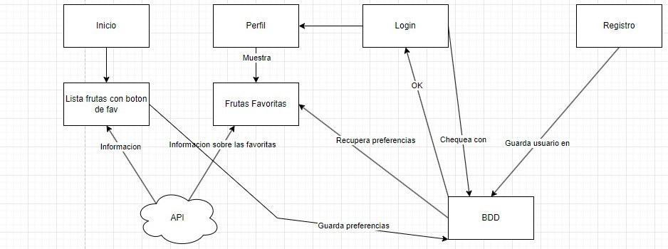

# [SyTW] **Fruit.js** - Grupo E04

- José Javier Díaz González - alu0101128894@ull.edu.es
- José Orlando Nina Orellana - alu0101322308@ull.edu.es
- Adahi Oval Afonso - alu0101242071@ull.edu.es
- Eduardo González Pérez - alu0101319001@ull.edu.es

###
| Página de despliegue:|
| --- |
| [Despliegue Fruit.js]() |

## Introducción

La aplicación de **Fruit.js** consiste en un sitio web que permite a los usuarios guardar como favoritos o listar una serie de frutas en la base de datos.

Todas la información sobre las frutas van recogidos de la [**API**](https://www.fruityvice.com/#3), y se guarda todas sus preferencias en la base de datos.

